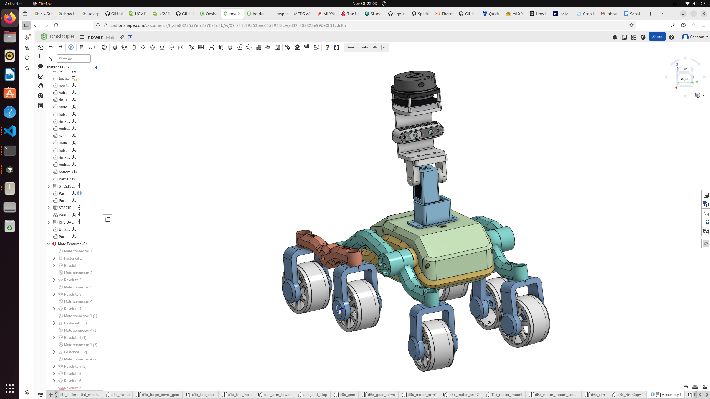

  <!-- Header -->
  <header style="text-align: center; margin-bottom: 80px;">
    <h1 style="font-size: 4rem; font-weight: 800; color: #000; margin-bottom: 10px; letter-spacing: -0.05em; text-transform: uppercase;">
      Mobile Fire Detection System
    </h1>
    

      by Sanatan Sinha
    

  </header>

  <!-- Hero Image -->
  

    
  

  

  <!-- FULL OVERVIEW SECTION -->
  <section style="max-width: 950px; margin: 0 auto 100px auto;">
    <h2 style="font-size: 2.8rem; font-weight: 700; color: #000; margin-bottom: 40px; text-align: center;">Overview</h2>
    

      The project investigated how making a mobile fire detection system could be a big improvement in response time than the conventional fire alarm system. The goal of the project was to make a mobile fire detection system which could not only detect the fire or signs of fire but also give the status of the house and can be remotely controlled, even when away. There was a web browser based website which would constantly give the status of the house when there was no fire, but if there was fire or any sign of fire, there would be a notification. 
        
      The testing first occurred in the house, then if the majority of the time the system was able to detect the fire and then give the notification, the testing occurred in the forest. The rover (the part that made the system mobile) was capable of climbing up and down the stairs and had 6 wheels. Not only was the ability to detect and give a notification of the fire going to be tested, but also the rover's ability to climb the stairs was going to be assessed. Both of the factors determined if this system passed or didn't pass. Because the rover might be limited to being terrestrial, a further improvement that could be made so every area in the forest could be monitored, was making a drone that could get launched from the rover (which would be improved so that it could be used as a launchpad for the drone), and then do surveillance over the forest. For further improvement, a drone would be added so it could reach every part of the forest in which the rover cannot reach.
        
      <b>Keywords:</b> Mobile fire detection system, rover, drone, fire alarm, surveillance
    

  </section>

  <!-- RESEARCH & PROBLEM STATEMENT (GLASSMORPHISM CARD) -->
  <section style="max-width: 950px; margin: 0 auto 100px auto; background: #fcfcfc; padding: 60px; border-radius: 24px; border: 1px solid #f1f1f1;">
    <h2 style="font-size: 2.5rem; font-weight: 700; color: #000; margin-bottom: 35px;">Problem Statement</h2>
    

      As of now, the majority of the fires tend to occur in the kitchen and in dry forests which is a really big hazard. More than 40 percent of the fires occur due to leaving the kitchen unattended, and can lead to many devastating effects that are hard to recover (NFPA, 2025). 
        
      When the house is unattended, a fire alarm is ineffective. Even though the fire alarm is really loud, there is no notification system in order to notify the person if they are away, which makes it really hard to get an immediate response to the situation. Also fire alarms are not mobile and are not vision based, so the fire alarms may not be able to get to every single area giving the risk of the fire continuing to the fire alarm, which is when every object in its path is destroyed. 
        
      A solution is to make a mobile fire detection system that includes a stair-climbing rover and one robot arm that has multiple fire detection sensors and has a camera. Unlike fire alarms, this approach can use computer vision including a YOLO model to detect the fire or any signs of fire, so that it can be dealt with before the situation gets worse. (Florida Atlantic University, 2025). Most importantly, the fire alarms cannot send a notification to the person and only the people near the house can hear the alarm, so, a website will be made, which gives the video clip of the fire and then gives a notification. Then for quick action the website will automatically call the fire station.
    

  </section>

  <!-- KEY FEATURES LIST -->
  <section style="max-width: 950px; margin: 0 auto 100px auto;">
    <h3 style="font-size: 2.2rem; font-weight: 700; color: #000; margin-bottom: 30px;">Key Features</h3>
    <ul style="font-size: 1.2rem; color: #333; line-height: 2;">
      <li><b>Dual Base Controllers</b>: Primary and secondary motor controllers for six-wheel drive system</li>
      <li><b>Rocker-Bogie Suspension</b>: Advanced suspension system for rough terrain navigation</li>
      <li><b>360° LiDAR Scanning</b>: Slamtec RPLidar A1M8 for real-time 360-degree mapping</li>
      <li><b>Computer Vision</b>: OpenCV-based object detection, face tracking, and on-screen display</li>
      <li><b>Fire & Smoke Detection</b>: YOLOv8-based AI model for early fire and smoke detection</li>
      <li><b>Gimbal Control</b>: Two-axis pan/tilt gimbal with Feetech STS3215 servos</li>
      <li><b>Steering System</b>: Four servo motors for precise steering control</li>
      <li><b>IR Temperature Sensor</b>: Ambient and object temperature monitoring</li>
      <li><b>Web-Based Control</b>: Flask/SocketIO web interface for remote operation</li>
      <li><b>Real-Time Video Streaming</b>: Live camera feed with OSD overlay</li>
    </ul>
  </section>

  <!-- HARDWARE COMPONENTS -->
  <section style="max-width: 950px; margin: 0 auto 100px auto;">
    <h2 style="font-size: 2.2rem; font-weight: 700; color: #000; border-bottom: 2px solid #eee; padding-bottom: 10px;">Hardware Components</h2>
    

      

        <h4 style="color: #666; text-transform: uppercase;">Chassis & Mobility</h4>
        <ul style="color: #444;">
          <li>6-Wheel Drive System</li>
          <li>Steering Servos: 4 serial bus servos (SCS-series)</li>
        </ul>
        <h4 style="color: #666; text-transform: uppercase; margin-top: 20px;">Sensors</h4>
        <ul style="color: #444;">
          <li>RPLidar A1M8: 360° 2D scanning LiDAR (12m range)</li>
          <li>IR Temperature Sensor: MLX90614 (Ambient/Object)</li>
          <li>Camera: USB camera for CV and streaming</li>
          <li>CPU Temperature monitoring</li>
        </ul>
      

      

        <h4 style="color: #666; text-transform: uppercase;">Actuators & Computing</h4>
        <ul style="color: #444;">
          <li>Gimbal Servos: 2x Feetech STS3215 (Pan/Tilt)</li>
          <li>Steering Servos: 6x SCS-series for wheels</li>
          <li>Raspberry Pi: Main control unit (Pi 4 or Pi 5)</li>
          <li>2x ESP32: Lower-level motor/sensor control via UART</li>
        </ul>
      

    

  </section>

  <!-- SOFTWARE ARCHITECTURE -->
  <section style="max-width: 950px; margin: 0 auto 100px auto; background: #fafafa; padding: 50px; border-radius: 20px;">
    <h2 style="font-size: 2.2rem; font-weight: 700; color: #000; margin-bottom: 30px;">Software Architecture</h2>
    

      

        <h4 style="color: #000;">Upper Computer (Raspberry Pi)</h4>
        <ul style="color: #444; font-size: 1.1rem;">
          <li>Flask Web Server</li>
          <li>SocketIO Bidirectional Communication</li>
          <li>OpenCV Image Processing</li>
          <li>YOLOv8 Detection</li>
          <li>Serial UART Communication</li>
        </ul>
      

      

        <h4 style="color: #000;">Lower Computer (ESP32)</h4>
        <ul style="color: #444; font-size: 1.1rem;">
          <li>Motor control</li>
          <li>Sensor data collection</li>
          <li>Low-level hardware interface</li>
        </ul>
      

    

  </section>

  <!-- WEB INTERFACE FEATURES -->
  <section style="max-width: 950px; margin: 0 auto 100px auto;">
    <h3 style="font-size: 2rem; font-weight: 700;">Web Interface Features</h3>
    <ol style="font-size: 1.2rem; color: #333; line-height: 2;">
      <li><b>Movement Control</b>: Joystick-style movement with speed control</li>
      <li><b>Steering Control</b>: Left/Right buttons for cumulative 5° adjustments</li>
      <li><b>Lidar Control</b>: ON/OFF buttons to start/stop 360° scanning</li>
      <li><b>Gimbal Control</b>: Pan and tilt sliders for camera positioning</li>
      <li><b>Temperature Display</b>: Real-time ambient and object temperatures</li>
      <li><b>Video Streaming</b>: Live camera feed with LiDAR point overlay</li>
      <li><b>Virtual Keyboard</b>: On-screen keyboard for touchscreen devices</li>
    </ol>
  </section>

  <!-- CONFIGURATION -->
  <section style="max-width: 950px; margin: 0 auto 100px auto;">
    <h3 style="font-size: 2rem; font-weight: 700;">Configuration & Mapping</h3>
    
The system uses <b>udev rules</b> for persistent device symlinks:

    

      /dev/base_secondary | /dev/steer | /dev/gimbal | /dev/rplidar | /dev/irtemp
    

  </section>

  <!-- CITATIONS & ACKNOWLEDGMENTS -->
  <footer style="margin-top: 150px; padding-top: 50px; border-top: 1px solid #eee; text-align: left; color: #777; font-size: 1rem;">
    <h4 style="color: #000;">Acknowledgments & References</h4>
    <ul style="list-style: none; padding: 0; line-height: 1.6;">
      <li>Based on <a href="https://github.com" style="color: #000;">Waveshare UGV Rover</a> project</li>
      <li>Uses YOLOv8, rplidar-roboticia, and rustypot.</li>
      <li>Selvam, R., et al. (2023). Cell Phone Controlled Robot With Fire Detection & Fire Fighting. IJERT.</li>
      <li>Florida Atlantic University. Mobile Fire Extinguishing Robot Team.</li>
      <li>NFPA (2025). Home Cooking Fires Report.</li>
      <li>Stair Climbing Rover. Printables.com.</li>
    </ul>
    

      Created by Sanatan Sinha
    

  </footer>

